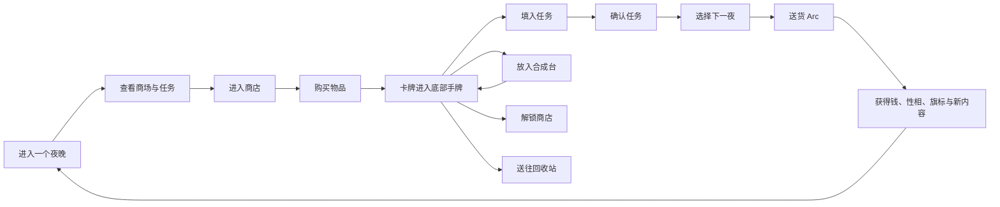

# 《千禧年购物指南》完整游戏设计

> 状态：当前游戏设计依据
> 更新日期：2026-08-06
> 类型：纯 2D 卡牌式购物与叙事游戏

## 1. 游戏概述

《千禧年购物指南》发生在一座临近千禧年的深夜商场。玩家扮演购物袋头，在商场地图与店铺内景之间切换，购买物品、完成任务、进行合成，并通过一次次选择积累主角的性相与人物关系，逐步走向不同结局。

游戏采用固定 2D 背景和可交互位置。商场地图负责地点选择，商店内景负责购物与店主互动，屏幕下方的卡牌栏保存玩家拥有的物品，左侧任务书签管理任务，右下角购物袋头打开合成台。

游戏的核心命题是：**选择物品，就是选择剧情。**

同一个需求通常可以由多种物品满足。玩家选择的物品会改变结算文案、任务分支、主角性相和后续事件。购物既是资源规划，也是轻量的性格测试。

## 2. 核心逻辑

### 2.1 核心循环



一个夜晚中的主要活动是逛商场：

1. 查看左侧任务书签，决定当前想解决的需求。
2. 从地图进入商店，观察商品与店主状态。
3. 点击商品查看详情和店主短评，选择商品并结账。
4. 已购买物品成为底部手牌中的实体卡牌。
5. 将卡牌拖入任务槽、合成台、地点锁位或回收站。
6. 确认准备完成的订单和照顾自己任务。
7. 在对应商店直接交付店主请求。
8. 随时选择进入下一夜，通过送货 Arc 结算已确认任务。

### 2.2 核心元素及其关系

| 元素 | 功能 | 与其他元素的关系 |
| --- | --- | --- |
| 夜晚 | 组织任务出现、货架补充和剧情节奏 | 下一夜时触发送货 Arc，并激活新的内容 |
| 钱币 | 购买商品的资源 | 初始拥有 10 枚；主要来自订单结算 |
| 物品卡牌 | 玩家进行选择和解谜的基本单位 | 可以进入手牌、任务、合成台、地点锁位或回收站 |
| 属性 | 描述物品的功能和感觉 | 决定物品与槽位的匹配、合成结果和任务分支 |
| 夜之性相 | 灯、镜、烛、枕 | 记录主角倾向，并影响剧情、合成与结局 |
| 任务 | 向玩家提出物品需求 | 消耗物品，给予金钱、性相、旗标、物品或后续任务 |
| 配方 | 将多张原料卡转化为一张新卡 | 为高级任务、人物请求和结局提供关键物品 |
| 商店 | 提供商品与实时互动 | 部分商店通过特定物品开放，开放后持续营业 |
| 店主 | 提供对话、请求与剧情分支 | 根据玩家交付的物品改变自身状态与后续故事 |
| 故事旗标 | 记录已经发生的选择 | 控制任务、商品、配方、人物事件和结局条件 |
| 送货 Arc | 跨夜结算阶段 | 统一处理已确认订单和照顾自己任务的结果 |

### 2.3 两种反馈节奏

游戏同时使用即时反馈和跨夜反馈。

| 反馈方式 | 使用场景 | 体验目的 |
| --- | --- | --- |
| 即时结算 | 合成、地图解锁、回收、店主请求 | 让购物阶段保持连贯、可反复尝试 |
| 送货 Arc 结算 | 订单、照顾自己、同期剧情 | 让选择经过一个夜晚后呈现叙事后果 |

订单中的物品在玩家点击“确认”后保持锁定。进入下一夜时，送货 Arc 消耗这些物品并展示结果。合成与店主交付则在当前商店阶段直接完成。

## 3. 夜晚与游戏推进

### 3.1 夜晚结构

每个夜晚由两个环节组成：

- **逛商场 Loop**：购物、对话、整理卡牌、填任务、合成和解锁地点。
- **送货 Arc**：结算当晚已经确认的任务，显示结果并进入新夜晚。

“下一夜”按钮始终可以使用。点击后出现确认窗口，玩家决定留在当前夜晚或进入送货 Arc。

未确认任务及其中的物品会跨夜保留。玩家可以把一个任务留在书签里，等到准备好合适的物品后再完成。

### 3.2 开放式时间

游戏以任务推进和故事条件组织节奏，天数作为时间感与内容激活条件。玩家可以用多个夜晚购物、尝试配方、积累资源或等待后续任务。

结局由故事任务、店主分支、关键物品和主角性相共同开放。玩家可以沿着雨林、地下水族馆、告别烟花、酒精灯小姐或灯泡男等方向逐渐形成自己的结局路线。

### 3.3 经济

- 新游戏拥有 10 枚钱币。
- 商品采用小数字价格，基础商品通常为 2 至 5，独特商品可达到 15，整体价格范围控制在 1 至 20。
- 订单在送货 Arc 中提供主要收入。
- 部分任务同时给予物品、配方提示或新任务。
- 回收站按卡牌的实际购买价原额返还。
- 合成物、地图钥匙和剧情物品作为受保护物品保留其叙事用途。

经济循环是：用少量初始资金购买基础商品，通过任务获得收入，再购买更丰富的商品和高级材料。

## 4. 商场地图与地点

### 4.1 商场地图

商场地图是一张静态 2D 背景，上面分布多个可点击地点。点击已开放商店后，画面切换到该商店内景；点击带锁地点后，地图下方显示一条解锁线索。

当前商场包含六个地点：

| 地点 | 初始状态 | 主要内容 |
| --- | --- | --- |
| 玩具店 | 开放 | 玩具、柔软材料、发条物品；气球先生 |
| 花店 | 开放 | 植物、香气、安睡与慰藉；向日葵头 |
| 快餐店 | 开放 | 食物、饮品和特殊气瓶；老鼠玩偶服 |
| 回收站 | 开放 | 回收普通已购物品 |
| 唱片店 | 锁定 | 音乐、灯与镜相关商品；留声机女士 |
| 书店 | 锁定 | 阅读、记忆与幻想相关商品；魔法少女头套 |

### 4.2 地点解锁

锁定地点要求一个特定物品。玩家将正确卡牌从底部手牌拖到地点上，物品被消耗，商店永久开放。

当前例子：

- 发条飞蛾打开唱片店的卷帘门。
- 午夜向日葵补全书店门上的纸太阳。

地点解锁是一种即时事件。地图在卡牌放入后立刻改变状态，并显示一行简短结果文案。

## 5. 商店与购物

### 5.1 商店内景

进入商店后，背景切换为该店的 2D 内景。左侧是商品货架，右侧是店主立绘与对话区域，底部继续显示玩家手牌，左侧继续显示任务书签。

店主会对商品和当前剧情状态作出反应：

- 点击商品时，店主说一句与商品有关的短评。
- 点击店主立绘或“交谈”按钮时，显示当前对话。
- 满足剧情条件后，交谈会激活新的店主请求、配方提示或特殊商品。
- 完成店主请求后，店主立绘和对话可以发生永久变化。

### 5.2 独立货位

每个货位是一件独立商品。同一页可以出现多个相同物品，例如：

```text
薯饼　薯饼　热牛奶
热牛奶　香蕉汽水　香蕉汽水
```

每家商店最多拥有三页货架，每页最多六个货位。第 1 页从商店开放时可用，第 2、3 页随着剧情与商品扩展逐步开放。

### 5.3 购买流程

1. 点击商品，打开物品详情并选中该货位。
2. 再次点击同一货位，取消选择。
3. 结账按钮显示当前件数和总价。
4. 点击结账后统一扣款。
5. 已购买商品从货位移除，并成为底部手牌中的卡牌。

货架商品用于查看和选择。完成结账后，玩家获得可拖动的实体卡牌。

### 5.4 商品供应

商品分为四种供应方式：

| 类型 | 供应逻辑 |
| --- | --- |
| 基础商品 | 空货位在下一夜补充 |
| 有限商品 | 以单独货位出现，购买后该商品保持售罄 |
| 事件商品 | 满足剧情条件后加入指定页面 |
| 合成物 | 通过配方产生并进入手牌 |

基础商品构成日常任务与合成的常用材料。高级商品带有更强属性、更明确的剧情意味和更高价格。

### 5.5 回收站

回收站的左侧区域用于放置待回收卡牌。玩家可以：

1. 从手牌拖入普通商品。
2. 查看已经放入的卡牌和合计返还金额。
3. 在确认前将卡牌拖回手牌。
4. 点击回收，清空回收区并获得等同于实际购买价的钱币。

回收站让玩家调整购物决定，同时保持小数字经济的可控性。

## 6. 物品系统

### 6.1 物品卡牌

完成购买后，每件物品以一张独立卡牌存在。卡牌可以位于：

- 屏幕底部的手牌栏。
- 某个任务的物品槽。
- 合成台的原料槽。
- 回收站的暂存区。

卡牌离开任务或合成槽时自动回到底部手牌。放入任务并完成结算的物品会被消耗；放入合成台并完成合成的原料也会被消耗。

### 6.2 属性结构

每件物品最多拥有四个属性，其中最多包含两个夜之性相。

属性分为两类：

- **标签属性**：表达物品类别与用途，例如食物、植物、玩具、音乐、饮品、酒、溶剂、气体、金属。
- **数值属性**：表达某种感觉或力量的程度，通常为 1 至 8，例如柔软、放松、助眠、酥脆、甜、温暖、电气和四种性相。

标签用于判断物品是否属于某一类；数值用于判断它满足需求的程度。

### 6.3 四种夜之性相

| 性相 | 意象 | 叙事倾向 |
| --- | --- | --- |
| 灯 | 交流电、夜晚街角、飞蛾噼啪作响、清醒的夜游者 | 清醒、行动、人工光、向外探索 |
| 镜 | 静室、白衣、追忆、铭记、似曾相识 | 记忆、自省、忧伤、回望过去 |
| 烛 | 幻觉、随想、远古鱼游过卧室的墙 | 梦境、变化、超现实、创造 |
| 枕 | 凉爽的鹅绒被、薰衣草、天明前的慰藉 | 休息、安抚、停留、接纳 |

性相同时承担三种功能：

1. 作为任务槽的允许属性或数值要求。
2. 决定合成配方的产物分支。
3. 在照顾自己和重要剧情选择中积累到主角身上。

### 6.4 物品例子

| 物品 | 价格与来源 | 属性 | 可能用途 |
| --- | --- | --- | --- |
| 自动售货机薯饼 | 快餐店，2 | 食物；酥脆 4、温暖 2、灯 2 | 夜宵订单、满足饥饿 |
| 纸杯热牛奶 | 快餐店，2 | 食物、饮品；放松 3、枕 4 | 夜宵订单、照顾自己 |
| 午夜向日葵 | 花店，2 | 植物；温暖 2、灯 4、枕 1 | 床头任务、窗台订单、开放书店 |
| 发条飞蛾 | 玩具店，6 | 玩具；电气 3、灯 3、烛 2 | 开放唱片店 |
| 玻璃弹珠 | 玩具店，2 | 玩具；追忆 4、镜 5、烛 1 | 生日订单、偏镜选择 |
| 婴儿安抚熊 | 合成获得 | 玩具；柔软 5、放松 6、枕 6 | 高级照顾与人物请求 |
| 二氧化碳气瓶 | 快餐店事件商品，15 | 气体、金属；枕 4、镜 1 | 气球先生分支 |

## 7. 底部手牌

底部手牌是玩家拥有物品的全局容器，在地图和商店中持续显示。

- 手牌容量采用无限横向滚动。
- 每张卡牌显示物品名称和主要性相。
- 点击卡牌打开物品详情。
- 拖动时卡牌本体跟随鼠标，并保留鼠标抓取点。
- 拖动期间其余卡牌保持原位置。
- 松手回到手牌时，根据落点调整卡牌顺序。
- 无效落点触发短回弹动画，卡牌返回原位。

手牌的意义是让玩家随时看见自己拥有什么，并在任务、合成、解锁与回收之间自由安排资源。

## 8. 任务系统

### 8.1 任务串

所有任务属于预先设计的任务串。任务可以根据夜晚、前置任务、故事旗标、主角性相、店主状态或完成次数激活。

任务可以形成：

- 线性连续节点。
- 二选一或多选一分支。
- 同时存在的并行任务。
- 可反复接取的日常请求。
- 累计完成若干次后推进的计数节点。
- 长期保留、由玩家自行选择完成时机的任务。

### 8.2 三类任务

| 类别 | 内容 | 结算时机 |
| --- | --- | --- |
| 订单 | 为商场外的人、机构或地点准备物品 | 下一夜的送货 Arc |
| 照顾自己 | 满足购物袋头当晚的愿望与需要 | 下一夜的送货 Arc |
| 店主请求 | 把店主需要的东西带回对应商店 | 店内即时结算 |

订单主要提供收入与世界故事。照顾自己主要积累主角性相。店主请求主要推动人物剧情、配方提示与结局旗标。

### 8.3 任务书签

活动任务以小横条书签排列在屏幕左侧中部：

- 书签显示短任务名和任务类别。
- 点击书签打开任务 Popup。
- 再次点击同一书签关闭 Popup。
- 点击另一书签时切换到新任务。
- 同时显示一个任务 Popup。
- 已确认任务使用特殊颜色或印章标记。
- 任务结算后，书签从列表中移除。

玩家在地图与所有商店中都能查看当前任务。店主请求同样进入书签，因此玩家可以随时确认店主需要什么。

### 8.4 任务 Popup

任务 Popup 包含：

- 一张任务背景图或氛围底图。
- 任务标题。
- 一段简短文案。
- 1 至 4 个物品槽。
- 当前状态反馈。
- 确认、取消确认或交付按钮。

任务窗口位于屏幕中左区域，保留底部手牌、部分商店货架和店主区域的可见性。

### 8.5 槽位规则

每个槽位只能容纳一件物品，可以组合以下规则：

- **必要**：物品具有列出的全部属性。
- **可以**：物品具有列表中的任意一种属性。
- **互斥**：物品与列出的属性保持互斥。
- **指定物品**：槽位接受若干明确物品。
- **数值门槛**：相关数值属性达到最低要求。

属性类型决定物品与槽位的语义匹配，属性数值决定任务是否达到确认标准。

例：任务需要“一件夜里能吃的东西”。槽位要求食物标签，并将酒列为互斥属性。薯饼和热牛奶都可以进入，二者携带的灯与枕会导向不同结果。

### 8.6 槽位高亮与放置反馈

- 点击槽位后，手牌中符合类型条件的卡牌出现白光呼吸效果。
- 当前商店中符合条件的商品货位也改变边框，提示购买方向。
- 其他卡牌保持正常亮度。
- 拖动卡牌时，可接受的槽位显示亮边框。
- 互斥槽位显示叉号或同等明确的拒绝符号。
- 有效卡牌松手后进入槽位。
- 无效卡牌松手后回弹到来源位置。
- 数值尚未达到要求时，槽位显示当前值与目标值。

### 8.7 确认与取消

订单和照顾自己任务满足要求后，可以点击“确认”。确认后：

- 对应卡牌保持在槽位中。
- 任务书签进入已确认配色。
- 任务等待下一次送货 Arc。
- 玩家可以在进入 Arc 前点击“取消确认”，重新选择物品。

店主请求在对应商店中显示“交给店主”。交付完成后立即消耗物品、显示结果并改变店主状态。

### 8.8 首批任务例子

| 激活夜晚 | 订单 | 照顾自己 |
| ---: | --- | --- |
| 第 1 夜 | 仓鼠之家的夜宵 | 饿了 |
| 第 2 夜 | 河堤夜话电台的征集 | 还不想睡 |
| 第 3 夜 | 失物招领处的生日 | 床头留一点东西 |
| 第 4 夜 | 没有太阳的窗台 | 雨声太近 |

此前激活的任务会与新任务并存，形成由玩家自行安排顺序的任务列表。

## 9. 送货 Arc

送货 Arc 是进入下一夜后的文字过场，统一结算已经确认的订单和照顾自己任务。

### 9.1 展示形式

- 画面淡入接近纯黑的全屏背景。
- 上方显示“第 N 夜 · 送货”。
- 中央每次显示一条任务结果文案。
- 结果可以同时带来钱币、物品、性相、故事旗标或新任务。
- 全部结果展示完毕后显示新夜晚编号，淡回商场地图。

Arc 使用文字、声音和少量图片制造夜晚经过的感觉，交互保持轻量。

### 9.2 结算内容

送货 Arc 依次处理：

1. 已确认订单的结果。
2. 已确认照顾自己任务的结果。
3. 由夜晚、旗标和主角性相触发的同期剧情。
4. 金钱、物品、性相和新任务的汇总。
5. 新夜晚的任务激活与基础商品补充。

如果当晚没有确认任务，Arc 显示一段简短的空夜文案，随后照常进入新夜晚。

### 9.3 选择物品就是选择文案

同一任务根据投入物品产生不同结果。

例：“仓鼠之家的夜宵”接受食物：

- 薯饼携带灯，仓鼠们决定连夜盘点仓库。
- 热牛奶携带枕，值夜的仓鼠把打卡钟盖上毯子。

两种选择都完成订单，但文案、奖励与故事旗标可以不同。

例：“床头留一点东西”接受植物：

- 向日葵让天花板的灯像一轮错误的太阳。
- 夜来香让熄灯后的房间出现更深的轮廓。
- 薰衣草枕袋带来一小块能够呼吸的安静。

## 10. 合成系统

### 10.1 合成台

右下角购物袋头是合成台入口。悬浮时头像高亮，点击后在屏幕右半部打开“购物袋之脑”。

合成台包含：

- 主角当前的灯、镜、烛、枕计数。
- 配方标签或配方图鉴入口。
- 2 至 4 个原料槽。
- 当前提示和预期产物。
- 合成进度与确认按钮。

合成台与一个任务 Popup 可以同时显示，底部手牌始终可用于拖动原料。

### 10.2 合成流程

1. 玩家把 2 至 4 张手牌放入原料槽。
2. 合成台根据属性、数值和性相判断当前组合。
3. 形成确定结果后，界面显示产物名称与短预览文案。
4. 点击“合成”后开始数秒的短过程。
5. 原料被消耗，产物卡牌进入底部手牌。

合成在当前购物阶段即时完成。产物可以继续用于任务、店主请求或更高级的配方。

### 10.3 配方发现

- 常规配方从开局即可通过实验触发。
- 未发现配方以模糊标签或匿名符号呈现。
- 店主对话会提供原料与属性方向的提示。
- 当组合形成明确产物预览时，配方加入图鉴。
- 特殊剧情配方由人物事件或故事旗标开放。

配方图鉴保存已经发现的组合，方便玩家后续查询，同时保留初次实验的神秘感。

### 10.4 泰迪熊配方例子

泰迪熊配方需要三个方向：

- 足够柔软的填充物。
- 具有玩具属性的形状。
- 足够放松的材料。

原料偏向镜与枕。系统比较投入物品的镜、枕总和：

- 镜更高时，产物是“童年的泰迪熊”，它认识主角忘掉的那间卧室。
- 枕达到或高于镜时，产物是“婴儿安抚熊”，它会安静地陪伴仍然醒着的人。

### 10.5 香蕉水配方例子

气球先生提出请求后，玩家获得香蕉水配方提示：

- 一份过分甜的液体。
- 一份能够擦去颜色的溶剂。

香蕉汽水与没有标签的模型漆可以合成香蕉水。香蕉水成为一张剧情卡牌，可以带回玩具店交给气球先生。

## 11. 店主剧情

### 11.1 店主互动

每位店主拥有自己的对话状态和任务串。剧情可以由以下条件激活：

- 夜晚达到某个阶段。
- 某项订单已经结算。
- 主角某种性相达到条件。
- 某个店主请求已经完成若干次。
- 玩家拥有或发现某个关键物品与配方。
- 另一个人物的故事已经发生变化。

店主会提供：

- 与当前商品有关的短评。
- 商场历史、都市传说与人物背景。
- 需要普通商品的请求。
- 需要合成物的特殊请求。
- 配方线索和特殊商品。
- 通往人物分支和结局的选择。

### 11.2 店主任务结构

店主任务可以形成线性、分支、并行与计数结构。

例：留声机女士会反复需要花或磁带。完成若干次日常请求后，她开始谈论随身听，并提供一个商场中买不到的物品线索。玩家需要通过合成制作随身听，再回唱片店交付。

例：某位店主可以反复收到花。不同花携带的性相改变短文案；累计完成三次后进入下一段人物剧情。

### 11.3 气球先生分支

完成“失物招领处的生日”后，与气球先生交谈会激活“擦掉笑容”：

- 他想用香蕉水擦掉脸上印着的笑容。
- 他也听说更重的气体能够让自己留在地面。
- 香蕉水配方随之开放。
- 快餐店第 2 页出现唯一的二氧化碳气瓶。

玩家只能交付一个答案：

| 答案 | 结果 | 主角变化 |
| --- | --- | --- |
| 香蕉水 | 笑容变淡，气球先生向天花板升去 | 烛 +1 |
| 二氧化碳气瓶 | 气球先生第一次安稳站在地面 | 枕 +1 |

这项选择即时改变气球先生的立绘、对话和故事旗标，并成为未来结局条件的一部分。

## 12. 主角性相与结局

### 12.1 主角性相积累

主角拥有灯、镜、烛、枕四个整数计数。计数来自：

- 照顾自己任务中所选物品携带的性相种类。
- 店主剧情中的重要选择。
- 特殊任务、首次配方和人物事件配置的奖励。

照顾自己时，每出现一种性相，对应计数增加 1，物品上的属性数值继续用于满足槽位和决定文案。

例：向日葵同时带有灯和枕。将它放在床头会让主角灯 +1、枕 +1；剧情文案强调错误的太阳与浅睡中的安慰。

### 12.2 性相的剧情意义

- **灯**倾向清醒、现实行动、寻找线索和照亮秘密。
- **镜**倾向回忆、自省、保存过去和辨认曾经发生的事。
- **烛**倾向幻觉、变化、创造超现实事物和跨越边界。
- **枕**倾向休息、安抚、停留、陪伴和接受离去。

性相用于开放人物事件、改变对话、影响任务结果，并与关键故事旗标共同构成结局条件。

### 12.3 结局方向

游戏通过任务串逐渐开放多个结局方向：

- 寻找地下水族馆，合成通往雨林的钥匙。
- 将购物中心本身创造为一座雨林。
- 邀请店主们在最后一夜举行聚会，观看千禧年的烟花。
- 推进酒精灯小姐的路线。
- 推进灯泡男的路线。
- 结合店主离开、停留或消失的状态形成复合结局。

结局判断同时读取主角性相、关键物品、配方发现、任务结果和店主状态。游戏时长由玩家推进这些故事条件的速度决定。

## 13. 界面总体布局

游戏以 1280 × 720 作为基础构图比例。

### 13.1 全局界面元素

地图与商店共享以下元素：

- 左侧中部：任务书签。
- 底部：手牌栏。
- 右下角：购物袋头与合成台入口。
- 右上角：唯一的物品详情 Popup。
- 屏幕中左：唯一的任务 Popup。

界面层级从背景到前景依次为：地图或商店、手牌与书签、任务 Popup、合成台、物品详情、确认框、送货 Arc。

### 13.2 地图布局

- 顶部左侧：游戏标题。
- 顶部右侧：当前夜晚、钱币、下一夜按钮、语言按钮。
- 中央：商场背景与六个地点热点。
- 左侧中部：任务书签。
- 下方居中：公共提示行，用于锁门线索和解锁结果。
- 底部：手牌。
- 右下角：购物袋头。

六个地点围绕地图的视觉空区分布，热点与背景中的店铺门面保持一致，并为左侧书签与底部手牌留出阅读空间。

### 13.3 商店布局

- 顶部：返回按钮、店名和钱币。
- 左侧约六成：货架、分页、结账与短反馈。
- 右侧约三成半：店主立绘、姓名、对话和交谈按钮。
- 左侧屏幕边缘：任务书签。
- 底部：手牌。
- 右下角：购物袋头。

任务 Popup 打开后位于中左区域。合成台打开后位于右半区域。玩家可以在保留商店信息的同时，从底部手牌向任务或合成槽拖动卡牌。

### 13.4 物品详情

点击商店商品、手牌卡牌或槽位卡牌后，右上角显示物品详情：

- 左侧为物品图片。
- 右上为物品名和关闭按钮。
- 右中为物品说明。
- 右下为属性图标与数值。
- 悬浮属性图标时显示属性名称和意象说明。

物品详情保留到玩家点击关闭，或由下一件被点击的物品替换。

### 13.5 合成台布局

- 购物袋头贴近右下角底边，并位于弹出面板之下。
- 合成面板使用深黑、半透明和轻微漂浮感，表现购物袋内部空间。
- 四性相位于面板顶部。
- 配方标签位于性相下方。
- 原料槽位于中央。
- 产物预览、进度和合成按钮位于下方。

### 13.6 Arc 布局

Arc 使用全屏黑色叠层覆盖当前界面。夜晚编号采用较小字号，结果文案位于中央并保持充足留白。每次只呈现一段结果，使玩家能够将注意力放在自己刚刚作出的选择上。

## 14. 视觉气质与文字密度

整体视觉方向是夜晚梦核商场：

- 深蓝绿色阴影。
- 局部暖黄灯光和苍白荧光。
- 透明或半透明面板。
- 轻微雾感、旧塑料、纸张、价签与玻璃反光。
- 商店内景和店主立绘承担主要氛围表达。
- 图标、物品形状和空间关系承担主要功能表达。

永久界面只保留短标题、价格、按钮与一行反馈。物品说明、属性意象、任务正文和剧情结果分别放入详情 Popup、属性提示、任务 Popup 和送货 Arc。

## 15. 双语功能

游戏支持中文 `zh_CN` 与英文 `en` 实时切换。

- 地图右上角提供语言按钮。
- 切换后，当前地图、商店、任务、卡牌、物品详情、合成台和对话立即刷新。
- 中英文保持相同的信息层级与视觉重点。
- 英文长文本在任务和详情区域自动换行。
- 属性同时使用图标、颜色和文字表达。

## 16. 当前 Demo 内容范围

当前可体验内容包括：

- 6 个商场地点。
- 5 位拥有独立文案的店主，以及无人值守的回收站。
- 21 种商品与合成物。
- 第 1 至第 4 夜激活的 4 个订单。
- 第 1 至第 4 夜激活的 4 个照顾自己任务。
- 气球先生的一条完整二选一店主分支。
- 泰迪熊与香蕉水两条合成配方。
- 唱片店与书店两个地点解锁。
- 开放式夜晚推进与自动保存。

后续内容沿用同一结构扩充新的物品、商店页、任务串、店主分支、人物事件、配方与结局。
