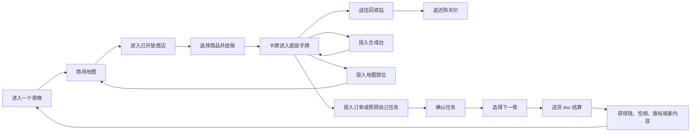

# 《千禧年购物指南》完整功能设计

> 状态：当前唯一有效的玩法与界面规格
> 更新日期：2026-08-06
> 适用范围：当前 Godot Demo 及其后续扩展

本文描述游戏目前采用的完整功能结构。旧 Polyomino 拼图、三夜原型和阶段性迁移方案均不属于当前设计；需要追溯时使用 Git 历史或标签 `polyomino-demo-v1`。

## 1. 游戏定位

《千禧年购物指南》是一款纯 2D、卡牌式的夜间购物与叙事游戏。玩家不是在场景中步行，而是在商场地图、商店内景、任务窗口和合成台之间切换，通过购买、选择、消耗和合成物品推进固定任务串。

游戏的核心命题是：**选择物品，就是选择一小段剧情。**

同一需求往往可以用多种物品满足。物品不仅有功能属性，也带有灯、镜、烛、枕等夜之性相。玩家为了“吃点东西”“给电台寄一件东西”或“满足店主的愿望”而选出的卡牌，会决定结算文案、金钱奖励、主角性相和后续剧情旗标。

体验气质应保持安静、舒缓而略带诡异：深夜商场、蓝绿色阴影、局部暖光或荧光、透明叠层、稀疏文字。界面是游戏世界的一部分，不应呈现成开发工具或规则说明器。

## 2. 核心逻辑

### 2.1 核心循环

一个夜晚中，玩家可以不限次数地逛商店、购物、整理手牌、填任务和尝试合成。点击“下一夜”永远可用，不要求完成任何任务。

进入下一夜前会出现确认 Popup：

- 已确认的订单和照顾自己任务会进入送货 Arc。
- 未确认任务和其中的物品保持原样，跨夜保留。
- 没有确认任何任务也可以离开，但本次 Arc 不会带来收入。
- 完成 Arc 后天数加一，基础货架补货，并激活当天预设的新任务。

游戏没有 20 天硬上限，也没有强制倒计时。结局未来由任务串、店主状态、故事旗标和主角性相共同解锁；当前 Demo 只积累这些状态，不执行正式结局。

### 2.2 两种结算时机

| 结算方式 | 使用场景 | 物品何时消耗 | 反馈 |
| --- | --- | --- | --- |
| 送货 Arc 延迟结算 | 订单、照顾自己 | 进入下一夜并开始 Arc 后 | 黑屏过场逐条显示结果，随后发钱、记录性相和旗标 |
| 店内即时结算 | 店主请求 | 在正确商店点击“交给店主”后 | 立即消耗物品，在店内显示结果并改变店主状态 |
| 合成即时结算 | 合成配方 | 点击合成并等待短计时结束后 | 原料消失，产物立即进入手牌 |
| 地图即时结算 | 解锁商店 | 把正确卡牌投入锁定地点后 | 卡牌消失，地点永久开放 |
| 回收即时结算 | 退回普通商品 | 点击回收后 | 卡牌消失，返还其实际购买价 |

Arc 与即时结算必须严格区分。店主交付和合成不应等待下一夜；订单也不应在玩家点击“确认”时提前消耗或播放结果。

### 2.3 核心元素如何相互作用

| 元素 | 作用 | 与其他元素的关系 |
| --- | --- | --- |
| 夜晚／天数 | 控制固定任务的激活与基础补货 | 只推进内容日程，不是失败倒计时 |
| 钱币 | 购买商品的资源 | 初始 10 枚；主要由 Arc 订单奖励产生 |
| 物品卡牌 | 玩家所有可操作资源 | 可进入手牌、任务、合成台、地图锁位或回收区 |
| 属性 | 描述物品能做什么、感觉如何 | 决定卡牌能否进入槽位以及任务能否执行 |
| 夜之性相 | 灯、镜、烛、枕 | 决定部分分支和合成产物；照顾自己时累计到主角 |
| 任务 | 消耗物品并产生结果 | 可发钱、加性相、设置旗标、解锁内容或改变店主 |
| 配方 | 把 2 至 4 张原料变成一张新卡 | 普通配方可自行试出；特殊配方由剧情开放 |
| 商店 | 提供商品和店主互动 | 一旦开放便始终可进入；货架可受剧情扩展 |
| 店主 | 提供实时短评、对话和请求 | 店主请求在店内交付，可产生唯一分支 |
| 故事旗标 | 保存剧情选择 | 决定事件、配方、商品和未来结局是否开放 |
| 自动存档 | 保存全部可变状态 | 任何关键状态变化后排队写入 v3 存档 |

## 3. 夜晚、经济与推进

### 3.1 夜晚推进

- 新游戏从第 1 夜开始。
- 点击地图右上方“下一夜”，出现二次确认。
- 按钮不会因未完成任务而锁定。
- 未完成任务不会失败，也不会在换夜时被删除。
- 当前首批内容只在第 1 至第 4 夜激活新任务；第 4 夜之后仍可继续购物、完成旧任务和换夜。

### 3.2 经济

- 初始资金：10 枚钱币。
- 没有白天上班界面、每日工资、换夜补助或保底收入。
- 商品价格采用小数字，基础商品通常为 2 至 5，独特商品可到 15，系统上限为 20。
- 订单在 Arc 中提供主要收入；照顾自己通常不发钱。
- 结账前商品不是玩家物品，不能拖入任务或合成台。
- 回收站按卡牌的实际购买价原额返还，不打折也不产生利润。
- 合成物、地图钥匙和剧情物品不可回收。

例：自动售货机薯饼价格为 2。玩家用它完成“仓鼠之家的夜宵”后，可能在 Arc 中获得 5 枚钱，但薯饼会被消耗。

### 3.3 商店补货

商品具有四种供应方式：

- `DAILY_BASIC`：基础商品；原有第 1 页货位为空时，在下一夜补回。
- `FINITE_ONCE`：有限商品；买走后不再补充。
- `EVENT_ONLY`：剧情商品；满足事件后才进入指定货位。
- `CRAFT_ONLY`：合成物；不会出现在商店货架上。

每个货位都是独立单位。两个薯饼表现为两个货位，而不是“薯饼 ×2”。玩家可以分别选择、购买和清空它们。

## 4. 物品卡牌与属性

### 4.1 卡牌生命周期

一张已拥有卡牌在同一时刻只能处于一个位置：

1. **底部手牌**：默认存放位置，可拖动和排序。
2. **任务槽**：暂时投入某个任务；不再出现在手牌中。
3. **合成槽**：暂时作为合成原料；不再出现在手牌中。
4. **回收区**：等待回收，可在确认前拖回手牌。
5. **已消耗**：任务、合成、地图解锁或回收完成后，从存档中移除。

卡牌从任务槽或合成槽拖回底部手牌时，不产生退款或复制。一个实例不能同时填入两个槽位。

### 4.2 属性种类

每件物品最多拥有 4 个非零属性，其中最多 2 个是夜之性相。

属性分为两类：

- **标签属性**：只判断有或没有，不显示数字，例如食物、植物、玩具、饮品、溶剂、气体、金属、音乐。
- **数值属性**：强度通常为 1 至 8，显示图标和数字，例如柔软、放松、酥脆、温暖，以及四种性相。

四种性相：

| 性相 | 意象 | 主要叙事倾向 |
| --- | --- | --- |
| 灯 `lamp` | 交流电、街角、飞蛾、清醒的夜游者 | 清醒、行动、人工光 |
| 镜 `mirror` | 静室、白衣、追忆、deja vu | 记忆、自省、忧伤 |
| 烛 `candle` | 幻觉、随想、远古鱼游过墙面 | 梦境、变化、超现实 |
| 枕 `pillow` | 凉被、薰衣草、天明前的慰藉 | 休息、安抚、停留 |

项目中统一使用 `candle / 烛`，不存在“纱”属性。

### 4.3 少量物品例子

| 物品 | 来源与价格 | 属性例子 | 典型用途 |
| --- | --- | --- | --- |
| 自动售货机薯饼 | 快餐店，2 | 食物；酥脆 4、温暖 2、灯 2 | 夜宵订单、解决饥饿 |
| 午夜向日葵 | 花店，2 | 植物；温暖 2、灯 4、枕 1 | 照顾自己、解锁书店 |
| 发条飞蛾 | 玩具店，6，有限 | 玩具；电气 3、灯 3、烛 2 | 唯一用于解锁唱片店 |
| 婴儿安抚熊 | 合成获得 | 玩具；柔软 5、放松 6、枕 6 | 高级任务材料或重要选择 |
| 二氧化碳气瓶 | 气球事件后快餐店第 2 页，15 | 气体、金属；枕 4、镜 1 | 气球先生分支答案 |

## 5. 任务系统

### 5.1 任务不是随机池

所有任务来自预先编排的任务串。它们可能按夜晚、前置任务、故事旗标、店主对话或计数器激活，但不会每天随机抽取两个“每日愿望”。

同一定义不会同时生成两个未结算实例。任务可以长期留在左侧书签中，不完成也不会阻止换夜。

当前有三类任务：

| 类别 | 目的 | 结算方式 | 是否可产生结构性分支 |
| --- | --- | --- | --- |
| 订单 | 为商场外的人或地点准备物品 | 送货 Arc | 可以 |
| 照顾自己 | 满足主角当晚的需求 | 送货 Arc | 不改变任务图，但有物品文案差异 |
| 店主请求 | 把特定答案带回店主 | 正确商店内即时交付 | 可以，而且通常是唯一选择 |

### 5.2 槽位规则

每个任务有 1 至 4 个槽位；每个槽位只能容纳一张卡牌。槽位可组合以下规则：

- **必要 `required_all`**：列出的属性必须全部存在。
- **可以 `allowed_any`**：如果非空，至少满足其中一种。
- **不可以 `forbidden_any`**：包含任意一种就不能放入。
- **指定物品 `accepted_item_ids`**：只接受列出的具体物品。
- **数值门槛 `value_requirements`**：属性值必须达到最低强度；可按单项、任选最高项或求和判断。

属性类型决定卡牌能不能放入；属性数值决定放入后能不能确认或执行。

例：一个槽位可以要求“必要：食物；不可以：酒”。薯饼可以放入。若另有“温暖至少 3”的数值门槛，温暖 2 的薯饼仍能放入，但槽位显示“数值不足”，任务不能确认。

### 5.3 选择、确认与撤销

- 点击空槽位，会让手牌中满足类型条件的卡牌出现白光呼吸高亮。
- 商店货架上满足条件的商品也会高亮，但必须先结账，之后才能拖动。
- 不匹配的卡牌保持正常显示，不整体变灰。
- 把有效卡牌拖到槽位并松手，卡牌进入槽位。
- 无效放置不会改变状态，卡牌以短动画返回原位。
- 未确认时，卡牌可在任务与手牌之间自由移动，也可转移到另一个任务或合成台。
- 任务满足全部数值要求后，“确认”按钮可用。
- 确认后卡牌锁定，但不会立即消耗；玩家可点击“取消确认”恢复编辑。
- 进入 Arc 后选择被冻结，才真正消耗卡牌。

店主请求没有“等待 Arc”的确认状态。玩家必须在对应商店中打开任务，放入答案，然后点击“交给店主”。在其他商店中按钮不可用。

### 5.4 首批任务日程

| 夜晚 | 新订单 | 新的照顾自己任务 |
| --- | --- | --- |
| 第 1 夜 | 仓鼠之家的夜宵 | 饿了 |
| 第 2 夜 | 河堤夜话电台的征集 | 还不想睡 |
| 第 3 夜 | 失物招领处的生日 | 床头留一点东西 |
| 第 4 夜 | 没有太阳的窗台 | 雨声太近 |

未完成的前一夜任务会与新任务并存。首批四夜之后不生成随机占位任务。

## 6. 送货 Arc

“Arc”是点击下一夜后的文字过场，也是订单和照顾自己任务的统一结算点。

结算顺序：

1. 二次确认离开商场。
2. 冻结所有已确认任务及其物品实例。
3. 黑色全屏叠层淡入，隐藏底部手牌和物品详情。
4. 一次性验证全部任务、结果和卡牌，避免结算一半后失败。
5. 原子地消耗卡牌、应用金钱／旗标／性相等效果。
6. 按任务顺序逐条显示结果文案。
7. 没有任务时显示一段空夜文案，收入为 0。
8. 天数加一，补充基础货位，激活新夜晚的固定内容。
9. 显示新夜晚编号，淡出并返回商场地图。

照顾自己任务会读取所消耗物品携带的性相种类：每出现一种性相，主角对应计数 `+1`，与该属性的数值大小无关。一张同时带灯和枕的物品会让灯、枕各加一次。

## 7. 合成系统

### 7.1 基本规则

- 点击右下角购物袋头进入“购物袋之脑”合成台。
- 合成台使用 2 至 4 个槽位，规则与任务槽一致。
- 玩家从底部手牌把已购买卡牌拖入合成槽。
- 放满且满足数值要求后，显示预期产物名称与短文案。
- 点击“合成”后进入约 2.5 秒的短计时；期间原料锁定。
- 计时结束后原料销毁，产物卡牌进入底部手牌。
- 合成是即时行为，不进入送货 Arc。

### 7.2 配方发现

- 普通隐藏配方从开局即可通过实验匹配，但未发现时只显示匿名菱形标签。
- 特殊配方必须先由剧情开放，开放前不能选择或执行。
- 玩家第一次看到确定产物预览／成功开始合成后，配方记入已发现状态。
- 合成台顶部用标签切换当前可用配方；进行中的合成不能切换。

例一：泰迪熊配方需要柔软填充、玩具形状和足够放松的材料，并限制原料只能偏镜／枕。投入性相总和偏镜时得到“童年的泰迪熊”，偏枕时得到“婴儿安抚熊”。

例二：香蕉水是气球先生事件开放的特殊配方。可使用香蕉汽水作为甜味液体、模型漆作为溶剂，合成剧情物品“香蕉水”。

### 7.3 四性相显示

合成台顶部固定显示主角当前的灯、镜、烛、枕计数。鼠标悬浮可查看性相说明。当前只显示和累计这些数据，不执行结局判断。

## 8. 商场与商店

### 8.1 六个地点

| 地点 | 初始状态 | 功能 |
| --- | --- | --- |
| 玩具店 | 开放 | 玩具、柔软材料、有限地图钥匙；气球先生事件 |
| 花店 | 开放 | 植物、慰藉和睡眠相关物品 |
| 快餐店 | 开放 | 食物与饮品；剧情后开放二氧化碳气瓶 |
| 回收站 | 开放 | 原价回收可回收的已购卡牌，不出售物品 |
| 唱片店 | 锁定 | 音乐、灯／镜相关物品 |
| 书店 | 锁定 | 阅读、记忆和幻想相关物品 |

地点没有每周营业排班。一旦开放，之后每一夜都可以进入。

### 8.2 地图解锁

- 点击锁定地点会在地图公共提示区显示线索。
- 把底部手牌中的正确卡牌直接拖到锁定地点，立即消耗并永久解锁。
- 错误卡牌不能投入，不会被消耗。
- 唱片店需要发条飞蛾；书店需要午夜向日葵。
- 地图解锁不是普通任务，不出现在左侧书签，也不等待 Arc。

### 8.3 货架与分页

- 每家普通商店最多有 3 页。
- 页面按钮位于商品区左上方；第 1 页默认开放，第 2、3 页未开放时禁用。
- 每页最多 6 个独立货位，可以出现重复商品。
- 点击商品同时完成三件事：查看物品详情、让店主说一句短评、切换该货位的购物选择状态。
- 选中货位仍只是购物清单，不会生成可拖动卡牌。
- 商品区右上方结账按钮显示已选件数和总价。
- 钱足够时结账：统一扣款，选中货位清空，卡牌进入底部手牌。
- 钱不足、没有选择或货位状态失效时，不改变钱包和库存，并显示短反馈。
- 换夜会取消尚未结账的选择。

当前高级货架例子：气球先生提出请求后，快餐店第 2 页开放一个唯一的二氧化碳气瓶货位；购买后该货位保持空置。

### 8.4 回收站

- 左侧商品区替换为一个回收放置区。
- 从底部手牌拖入普通已购卡牌，会显示待回收卡牌和合计返还金额。
- 确认前可把卡牌拖回手牌。
- 点击回收后，待回收卡牌全部销毁，按每张卡保存的实际购买价返钱。
- 回收不受商品标价变化影响，也不能通过买卖获利。

### 8.5 店主互动

- 商店右侧显示店主立绘、姓名、短对话和“交谈”按钮。
- 点击立绘或交谈按钮，根据当前旗标显示待机对话、触发请求或给出提醒。
- 点击货架商品时，店主短评会引用当前商品名称。
- 店主状态变化后，立绘和对话同步变化；店主离开时柜台可以保持空置，但商店仍可营业。
- 当前没有好感度、等级经验或消费折扣系统；后续店主剧情通过任务串、旗标和计数器扩展。

## 9. 店主事件例子：气球先生“擦掉笑容”

这是当前 Demo 的完整店主分支，用于验证实时对话、特殊商品、特殊配方和唯一选择。

激活条件：

1. “失物招领处的生日”已经在 Arc 中结算。
2. 玩家进入玩具店并点击气球先生。
3. `balloon_route` 尚未确定。

激活后同时发生：

- 左侧加入“擦掉笑容”店主任务。
- 开放香蕉水配方提示和配方匹配。
- 快餐店第 2 页开放唯一的二氧化碳气瓶。

玩家只能交付一种答案：

| 答案 | 即时结果 | 状态变化 |
| --- | --- | --- |
| 香蕉水 | 笑容变淡，气球先生向天花板升去 | 烛 `+1`；`balloon_route=flight`；立绘离开柜台 |
| 二氧化碳气瓶 | 气球先生第一次安稳站在地面 | 枕 `+1`；`balloon_route=ground`；店主留在玩具店 |

提交后物品消耗、任务从书签移除、另一条分支永久关闭。结果立即显示在玩具店，不进入送货 Arc。

## 10. 界面总布局

基准视口为 1280 × 720。所有主界面共享底部手牌、左侧任务书签、右下角主角入口和右上角物品详情等全局层。

### 10.1 全局视觉层级

从低到高：

1. 商场地图或商店内景。
2. 底部手牌与左侧任务书签。
3. 当前任务 Popup。
4. 合成台与右下角购物袋头。
5. 物品详情及属性说明。
6. 下一夜确认框或全屏送货 Arc。

同一时间最多打开一个任务 Popup、一个合成台和一个物品详情。任务 Popup 与合成台可以并存；新打开的物品详情会替换旧详情。

### 10.2 商场地图

- **顶部左侧**：游戏标题。
- **顶部右侧**：第几夜、当前钱币、“下一夜”按钮和语言切换按钮。
- **中央大区域**：以 `map.png` 为背景，六个半透明地点热区覆盖在对应建筑上。
- **左侧中部**：当前任务书签纵向排列。
- **下方居中**：地图共用的一行短提示，用于显示锁门线索和解锁结果；没有消息时完全隐藏。
- **底部**：全局手牌栏。
- **右下角**：贴近底边的购物袋头，位于其衍生界面之下。

地图地点大致分布为：回收站在左上，书店在右上，玩具店在左下，花店在中下偏左，唱片店在中下偏右，快餐店在右下。位置需要避开任务书签和底部手牌。

### 10.3 商店界面

- **顶部**：返回按钮、店名、钱币。
- **左侧约 60%**：货架面板。标题和分页在上，3 × 2 商品货位在中，短反馈在下；结账按钮固定在货架标题右侧。
- **右侧约 35%**：店主区域。立绘／占位形状在上，姓名居中，对话在中下，“交谈”按钮在底部。
- **左侧屏幕边缘**：任务书签仍然可见。
- **底部**：手牌保持可见，可直接拖入打开的任务或合成槽。
- **右下角**：购物袋头保持可用。

进入回收站时，右侧保持地点氛围；左侧货架替换为大面积回收放置区。

### 10.4 底部手牌

- 固定高度约 132 像素，横跨屏幕底部。
- 标题只占一行；空手时显示一句“纸袋很轻”。
- 卡牌横向排列，容量不设上限，超出宽度后水平滚动。
- 每张卡约 150 × 92，显示名称和携带的夜之性相。
- 拖动时以卡牌原尺寸跟随鼠标，并保留鼠标抓取点。
- 拖动期间其他卡牌不即时补位；松手后才根据落点调整顺序。
- 无效落点触发短回弹动画，卡牌返回拖动前位置。

### 10.5 左侧任务书签与任务 Popup

书签：

- 位于左侧中部，纵向排列所有活动任务。
- 显示短任务名，不放大段规则说明。
- 已确认任务使用不同边框颜色。
- 点击书签打开任务 Popup；再次点击同一书签关闭。
- 点击另一书签会替换当前任务 Popup，因此同时最多一个。
- 任务结算后书签删除。

任务 Popup：

- 位于屏幕中左区域，约 690 × 440，不覆盖整个商店。
- 顶部为任务名和关闭按钮。
- 中部为短文案与 1 至 4 个槽位。
- 槽位显示规则摘要、卡牌和“可以／数值不足”等状态。
- 底部为反馈和“确认／取消确认／交给店主”操作。

### 10.6 合成台

- 入口是右下角购物袋头；悬浮时使用高亮贴图。
- 点击后在屏幕右半部打开深黑半透明面板，再次点击或关闭按钮收起。
- 顶部显示购物袋之脑标题和四性相计数。
- 其下为可用配方标签；未发现配方以匿名菱形表示。
- 中部显示当前配方名、2 至 4 个槽位和预览文案。
- 底部显示短进度条与合成按钮。
- 面板关闭后，已开始的短合成仍继续计时并写入存档。

### 10.7 物品详情 Popup

点击货架商品、底部卡牌或槽位中的卡牌，右上角显示唯一的物品详情：

- 左侧：物品图片；无素材时用名称首字占位。
- 右上：物品名和关闭按钮。
- 右中：物品说明。
- 右下：属性图标；标签不显示数字，数值属性显示强度。
- 悬浮属性图标时，在详情下方临时显示属性名称和说明；鼠标移开后隐藏。
- 物品详情必须由右上角 `×` 关闭，或被新点击的物品替换。

### 10.8 送货 Arc 界面

- 黑色全屏叠层覆盖所有交互界面。
- 上方以小字显示“第 N 夜 · 送货”。
- 中央显示当前结算文案，每项停留约一秒多。
- 不显示复杂按钮、列表或数值表格。
- 全部结果结束后显示新夜晚编号并淡回地图。

## 11. 通用交互反馈

- 点击任务／合成槽后，符合类型条件且仍在手牌中的卡牌以白光缓慢闪烁。
- 货架上可用于当前槽位的商品也改变边框，但不会自动购买。
- 其他卡牌保持正常亮度，避免把界面变成大片灰色。
- 已放进槽位的卡牌不再参与手牌高亮。
- 任务确认后，槽位卡牌不可拖动；取消确认后恢复。
- 合成进行中，配方切换、槽位拖动和合成按钮全部锁定。
- 操作失败只在相关区域显示一行短反馈，例如“钱不够”“数值不足”“要去对方的店里交付”。
- 不在永久界面上堆叠教程段落；次要说明放到 tooltip、物品详情或上下文反馈。

## 12. 语言与可访问性约束

- 所有玩家可见文字必须有 `zh_CN` 与 `en` 两套翻译键。
- 地图右上角按钮支持游戏运行中即时切换语言，不需要重启场景。
- 中英文保持相同的信息层级；英文较长时应换行或截断，不允许溢出。
- 属性使用图标、颜色和文字共同表达，不能只依赖颜色。
- 可点击区域应有悬浮反馈，锁定按钮应有 tooltip 或公共提示。

## 13. 存档范围

当前存档格式为 v3，自动保存以下内容：

- 天数与钱币。
- 卡牌实例、购买价、手牌顺序和当前位置。
- 活动任务、槽位分配、确认状态、结果历史。
- 主角四性相计数。
- 故事旗标和店主状态。
- 已开放商店。
- 各商店货架页、独立货位、空货位和已开放页数。
- 回收站待处理卡牌。
- 已知／已发现配方、当前配方、合成槽和进行中计时。
- 进行到一半的送货 Arc 及已显示到哪一条结果。

当前 v3 能读取增加分页功能前的 v3 单页货架快照。旧 Polyomino／slot-card v2 存档不兼容，也不会迁移到当前玩法。

## 14. 当前 Demo 内容量

- 6 个商场地点。
- 5 位有独立文案的店主；回收站无人值守。
- 21 种商品与合成物。
- 4 个带分支的订单。
- 4 个无结构性分支的照顾自己任务。
- 1 个完整店主分支事件。
- 2 个可执行合成配方。
- 2 个地图商店解锁。
- 无限夜晚的数据结构和自动存档。

这些数字是当前 Demo 内容量，不是长期游戏上限。后续增加内容时应复用现有物品、任务、配方、店主和故事效果结构，不另建平行系统。

## 15. 明确废弃或尚未实现的内容

以下内容不属于当前版本，不应重新加入代码或界面：

- Polyomino 格阵、旋转骨牌、特殊大块、空袋子整理区。
- 步行模拟或 3D 商场探索。
- 白天上班小游戏、固定工资或每日保底收入。
- 每天随机抽取两个愿望的随机任务池。
- “完成每日目标才能下一天”的硬门槛。
- 20 天强制结束或失败倒计时。
- 每周店铺营业排班。
- 店主好感度经验、等级、消费折扣。
- 旧版无限背包 Popup。

以下内容属于未来扩展，但当前只保留数据接口或叙事伏笔：

- 正式结局判定与结局演出。
- 酒精灯小姐、灯泡男的完整事件。
- 其他店主的分支任务串。
- 第 4 夜之后的长期任务内容。
- 完整配方图鉴、分类与搜索。
- 正式经济平衡和物品重复使用衰减。
- 最终美术、音效与完整过场插图。

## 16. 功能验收原则

新增功能只有同时满足以下条件才算完成：

1. 不破坏“购物获得卡牌—选择任务／合成—即时或 Arc 结算”的核心循环。
2. 新物品最多 4 个属性、最多 2 种夜之性相，标签属性不伪造数值。
3. 物品实例不会复制、跨槽重复占用或在错误结算时机消失。
4. 下一夜永远可用，未确认任务跨夜保留。
5. 商店货位、有限库存、任务、配方和进行中 Arc 均可正确保存和恢复。
6. 中文和英文同步提供，并在 1280 × 720 下保持可读。
7. UI 保持夜晚梦核商场气质，用短文本和空间关系表达功能。
8. 当前分支不重新引用归档的 Polyomino／slot-card 运行时。
